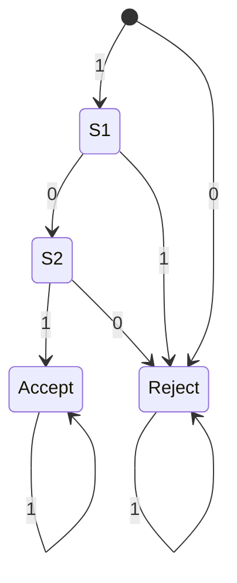
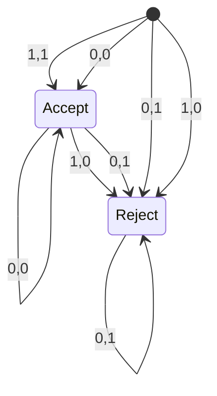

# Automata Tactic

This is documentation for how the automata tactic works. This tactic deserves documentation because it is non-trivial and contains some difficult concepts.

By analogy, the automata tactic is like Presberger Arithmetic. Just like Presberger Arithmetic only involves constant-memory operations on natural numbers,
the Automata Tactic can automatically solve expressions on BitVectors which involve constant-memory operations.

# Goal of the Automata Tactic

The automata tactic is a decision procedure. It takes in statments of the form

\[
\forall (w : \mathbb{N})
\forall (x_1, x_2, x_3, \ldots x_n : BitVec w)
(x_1 &&& x_2) + (x_1 ||| x_2) = (x_1 + x_2)
\]

The automata tactic only accepts expressions containing finite memory operations, or operations which can 
be implmeneted with an amount of extra memory scratch space which does not depend on the size of the inputs.
For example, the automata tactic works with

1) Bitwise operations (which require 0 extra bits of memory scratch space)
2) Addition and subtraction (which require 1 extra bit of memory scratch space)
3) negation (which requires 1 extra bit of memory scratch space)

But crucially, the automata tactic does not support multiplication, because the amount of memory
required to do a multiplication depends on the size of the inputs.

The reason that this tactic only accepts operations of constant memory is that this corresponds to state machines with a finite number of states.
If we accepted multiplication as an operation, the number of states in the state machine could potentially blow up.

# How is the Automata Tactic Implemented?

To figure out if 

\[a = b\]

we ask:
Does the automaton 

\[automaton(a ^^^ b)\]

accept the string of all zeros?

To transform a bitvector expression into a finite state machine, we follow a series of rules.

Our FSMs have an arity, or number of arguments. The arity is equal to the number of free variables
in the expression plus one (for the input).

## FSM for constant
Any constant can be turned into an FSM of arity 1. The FSM will check if the input is the binary representation of that number. For example, 
here is the FSM for "5" (which is 101 in binary)

## FSM for Variable
A variable correspond to an FSM of arity 2, because there is one free variable and one input stream.

Here is the FSM for a free variable:

## FSM Composition
We can compose FSMs to form larger FSM expressions. I don't understand how this works. 

